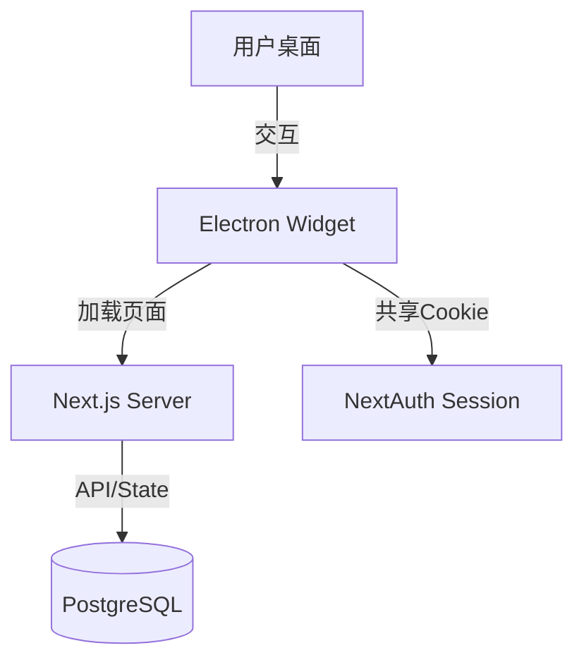

# RFC: Desktop Timer Widget for Project Nexus

## 1. 摘要 (Summary)
开发一个基于 Electron 的轻量级桌面“挂件”应用，作为 Project Nexus 计时器功能的延伸。该应用将是一个无边框、始终置顶的浮窗，专门用于显示当前任务状态并提供极简的“切换/暂停”控制，旨在消除用户在多任务切换时需要切回浏览器标签页的摩擦力。

## 2. 背景与动机 (Motivation)
- **痛点**：用户在进行高强度多线程工作时（如编码、阅读文档），频繁切换浏览器标签页来管理计时器会打断心流，增加操作摩擦力。
- **目标**：提供一个类似于 Windows 11 时钟小组件的桌面体验——无感、常驻、触手可及。
- **现有局限**：
    - 浏览器标签页容易被淹没。
    - 现有的 PWA/画中画方案存在边框或交互限制，无法达到完美的视觉洁癖要求。

## 3. 技术架构 (Technical Architecture)

### 3.1 架构概览
采用 **"Thin Client" (瘦客户端)** 模式：
- **服务端 (Brain)**: 现有的 Next.js 应用 (`project-nexus`)。负责所有业务逻辑、数据库交互、认证和状态管理。
- **客户端 (Face)**: 一个极简的 Electron 应用。本质上是一个定制化的浏览器窗口，只负责加载特定 URL 并提供系统级窗口特性（无边框、置顶、透明）。

### 3.2 关键组件

#### A. Next.js 端 (`/app/features/timer/widget`)
一个专门为小尺寸窗口设计的页面路由。
- **UI 设计**:
    - 尺寸目标: ~300px x 150px
    - 背景: 透明 (依赖 CSS `html, body { background: transparent }`)
    - 交互: 
        - 整个窗口可拖拽 (`-webkit-app-region: drag`)
        - 按钮区域不可拖拽 (`-webkit-app-region: no-drag`)以保证点击灵敏度
- **功能**:
    - 显示当前运行任务名称（大字号）
    - 显示实时正计时 (Elapsed Time)
    - 播放/暂停按钮
    - "停止"按钮（可选，视作暂停）
    - "最近任务"快速切换列表（Hover 时显示）

#### B. Electron 端 (`timer-widget-electron`)
一个独立的 Node.js 项目。
- **BrowserWindow 配置**:
    - `frame: false` (无边框)
    - `transparent: true` (支持透明背景/圆角)
    - `alwaysOnTop: true` (始终置顶)
    - `resizable: false` (固定尺寸)
    - `skipTaskbar: true` (可选，不在任务栏显示，只在托盘)
- **Session 共享**:
    - Electron 需要能够访问 Next.js 的 `next-auth.session-token` Cookie。
    - **方案**: Electron 启动时加载 `localhost:3000`，如果用户在 Chrome 已登录，Electron 可能无法直接获取 Cookie（因为是不同的存储）。
    - **解决策略**: 
        1. 在 Electron 中提供登录界面（复用 Next.js 登录页）。
        2. 或者，在 Electron 启动时检查未登录状态，跳转到 `http://localhost:3000/auth/signin`。由于 Electron 也是 Chromium，登录后 Cookie 会自动保存，后续请求即可携带凭证。

## 4. 详细设计 (Detailed Design)

### 4.1 Widget 页面 UI 规范
- **布局**: Flexbox 垂直居中。
- **字体**: 使用等宽字体显示时间 (e.g., `Geist Mono`) 避免跳动。
- **配色**: 
    - 默认: 深色半透明背景 (rgba(0,0,0,0.85)) + 白色文字。
    - 运行中: 绿色/高亮边框指示。
    - 暂停: 黄色/灰色指示。

### 4.2 交互流程
1. **启动**: 用户运行 `nexus-widget.exe`。
2. **加载**: 窗口出现，显示 Loading... -> 加载 `/timer/widget`。
3. **鉴权**: 
    - 若未登录 -> 显示“请登录”按钮 -> 点击弹出新窗口打开登录页 -> 登录成功后刷新 Widget。
4. **日常使用**:
    - 只有时间在走。
    - 鼠标悬停 -> 显示控制按钮。
    - 点击“暂停” -> 状态同步到服务器。
    - 鼠标移出 -> 恢复极简模式。

### 4.3 边缘情况处理
- **网络断开**: 显示离线图标，本地继续倒计时（依赖 React state），网络恢复后同步。
- **服务器关闭**: 显示重连提示。

## 5. 开发路线图 (Roadmap)

1. **Step 1 (Next.js)**: 开发 `/timer/widget` 页面，确保在普通浏览器中通过调整窗口大小能正常工作。
2. **Step 2 (Electron)**: 初始化 Electron 项目，配置无边框窗口加载该页面，验证透明效果。
3. **Step 3 (Integration)**: 处理登录状态共享问题，确保 API 请求正常。
4. **Step 4 (Polish)**: 打包为 `.exe`，配置图标。

## 6. 待决问题 (Open Questions)
- 是否需要支持“迷你模式”和“列表模式”的切换？(V1 先做固定尺寸)
- Electron 应用放在哪个目录下？建议 `root/timer-widget-electron`。

